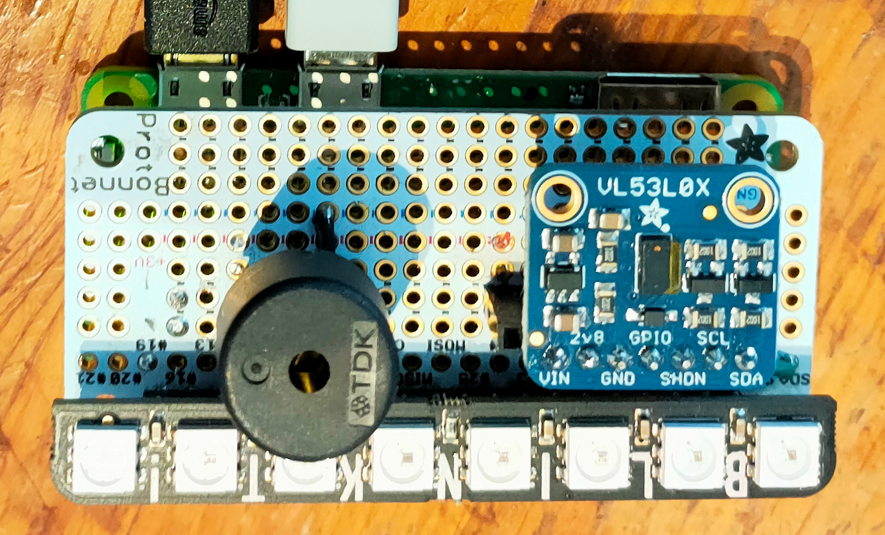

# Lazydoro Mk II


Lazydoro is a small device that helps writers and programmers to practice the
[Pomodoro technique](https://en.wikipedia.org/wiki/Pomodoro_Technique).



If you're writing text or code, you probably work at a desk. Lazydoro can see if you're at your desk.

When you sit down it assumes you're starting a Pomorodo. It will show you how time is passing and will remind you 
to tak a break when the pomodoro is complete.

Lazydoro assumes that you will get up from your desk when taking a break.
It will start timing the break when you leave your desk, and it will alert you when the break time is over.

When you've completed a pomodoro/break cycle, Lazydoro will be ready for you st start again.

I documented this behaviour more formally in [a use case](docs/use-case.md).

The current version of Lazydoro Mk II is driven by a Raspberry Pi Zero. Other models of Pi could be used instead.

The additional hardware  is described [here](docs/hardware.md).

## Installing the software

I will package Lazydoro when it's stable. Until then, once you have built the hardware,

1. Clone this repository on the Raspberry Pi.
2. Install the required software:
```shell
curl https://get.pimoroni.com/blinkt | bash 
pip3 install adafruit-circuitpython-vl53l0x
pip3 install PyHamcrest # needed for testing

```

## Running the software

```shell
cd <project root>/src
python3 run.py
```

You can stop it by typing `crtl-C`.

## Future plans

I'm now using this project, and will start blogging about the implementation.

As of today (2 April 2022) automated test coverage is at 97%.
That's a high figure for an embedded Python application!

I plan a few minor improvements to hardware and software as I gain experience with it. 

I _may_ also port it to run on an Adafruit feather board with a different display.


