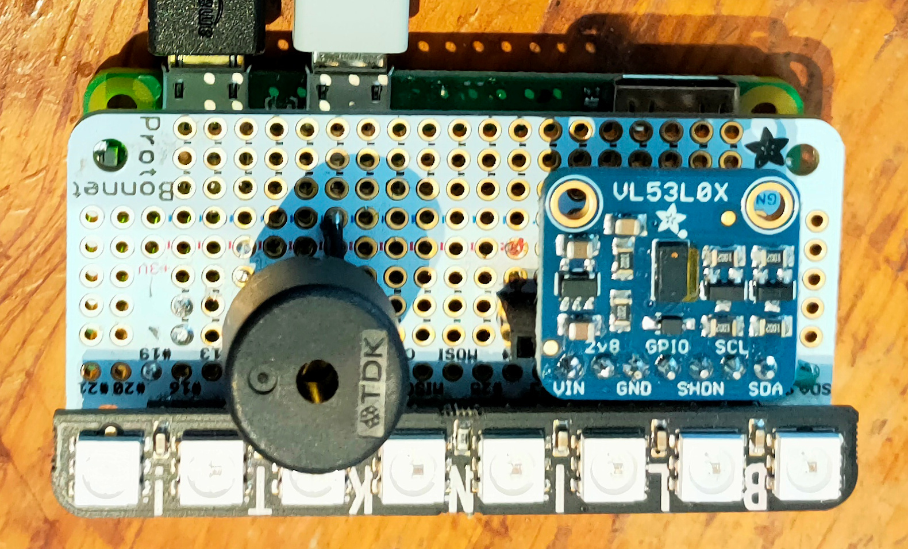

# Lazydoro Mk V

Lazydoro is a small device that helps writers and programmers to practice the
[Pomodoro technique](https://en.wikipedia.org/wiki/Pomodoro_Technique).



If you're writing text or code, you probably work at a desk. Lazydoro can see if you're at your desk.

When you sit down it assumes you're starting a Pomorodo. It will show you how
time is passing and will remind you 
to tak a break when the pomodoro is complete.

Lazydoro assumes that you will get up from your desk when taking a break.
It will start timing the break when you leave your desk, and it will buzz 
to alert you when the break time is over.

When you've completed a pomodoro/break cycle, Lazydoro will be ready for
you to start again.

I documented this behaviour more formally in [a use case](docs/use-case.md).

The current version of Lazydoro Mk 5 is driven by a Raspberry Pi Zero. Other models could be used instead.

The additional hardware for the Pi is described [here](docs/hardware.md).

## Development setup

1. Clone this repository.

2. Create and activate a virtual environment:

   ```shell
   python3 -m venv venv
   source venv/bin/activate
   ```

3. Install dependencies:

   ```shell
   pip install -r requirements.txt
   ```

4. Run the tests:

   ```shell
   pytest
   ```

The MQTT integration tests require a Mosquitto broker running on a host called `watcher`,
and `mosquitto_pub` installed locally.

## Installing the software on a Pi

Once you have built the hardware:

1. Clone this repository on the Raspberry Pi.

2. Create and activate a virtual environment:

   ```shell
   python3 -m venv venv
   source venv/bin/activate
   ```

3. Install the required software:

   ```shell
   pip install -r requirements.txt
   ```

## Running the software on the Pi

```shell
source venv/bin/activate
cd <project root>/src
python3 runner.py
```

You can stop it by typing `ctrl-C`.

## Future plans

I'm now using this project, and will start blogging about the implementation.


