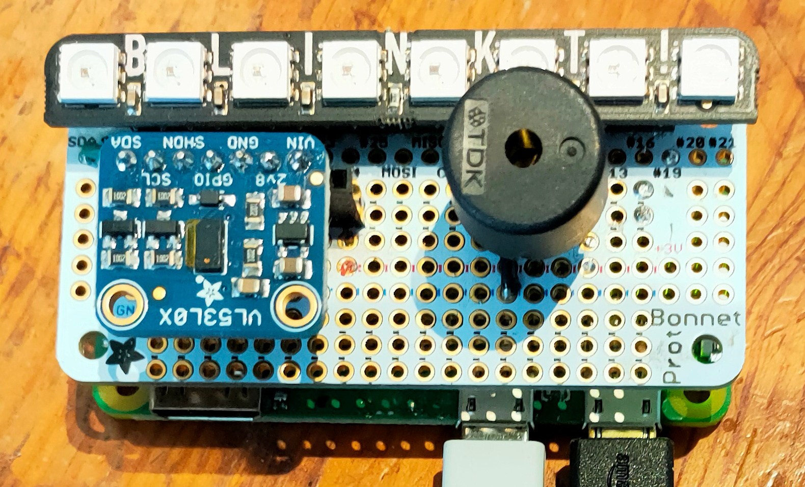
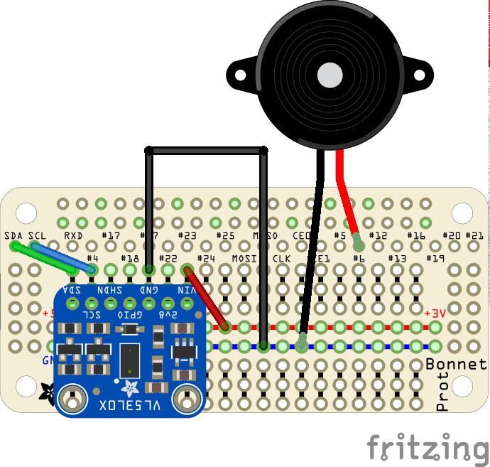

# Lazydoro Mk II hardware

The **Lazydoro bonnet** sits on top of a Raspberry Pi zero.

### Bill of Materials

It's an [adafruit perma proto bonnet](https://www.adafruit.com/product/3203) on which is soldered

1. A socket that holds a [VL530X breakout](https://www.adafruit.com/product/3203)
2. A socket that holds a Piezo buzzer 
3. On top of the bonnet sits a [Pimoroni Blinkt!](https://shop.pimoroni.com/products/blinkt?variant=22408658695) NeoPixel 
display bar.

### Wiring diagram

The diagram does not show the Blinkt bar because I cannot find a Fritzing component for it, and Fritzing won't 
export the diagram as svg :(

The bar sits on top of the GPIO pins which pass through the ProtoBonnet
